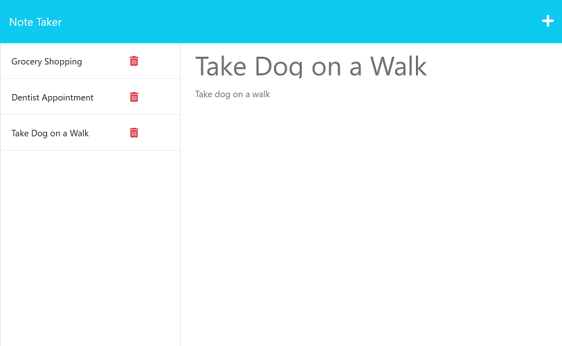

# Note Tracker

  

  ## Table of Contents
  * [Description](#description)
  * [Installation](#installation)
  * [Usage and Walkthrough Video](#usage-and-walkthrough-video)
  * [Licenses](#licenses)
  * [Credits](#credits)
  * [Contributing](#contributing)
  * [Questions](#questions)

  ## Description
  This is a web application that allows a user to save notes to a tracking list.  New notes can be added to the list, current notes can be viewed and deleted.  This application utilizes many different coding platforms and concepts including NodeJS, ExpressJS, JavaScript, HTML, CSS, modular routing, and API calls.  

   
  

  ## Installation
  There are no installation instructions for this application. The application is deployed to Heroku and is accessible via web browser at the following URL:  https://polar-reaches-84206.herokuapp.com/.

  ## Usage and Walkthrough Video
  The user will access the application via the URL provided above in the Installation section.  Once the Note Taker homepage loads, the user can click on the Get Started button where they will be taken to the Notes page.  On the Notes page the user can create a new note by entering text in the Title and Text fields and clicking the Save button in the upper-right corner.  That note will get added to a list of saved notes on the left-side of the application.  Saved notes can be access by clicking on them and they can be deleted by clicking the trash icon associated with each note.

  Here is a walkthrough video showing full functionality of the application:
  https://drive.google.com/file/d/1u9WLm2uuLVUp61C1siXzEjRS07YDOCJb/view

  ## Licenses
  This project is covered under the MIT license. To learn more about what this means, click the license badge at the top.

  ## Credits
  I referenced and used code from several of the lessons from UCF Full Stack Bootcamp Module 11 (Express), in particular the end of module mini-project.  

  ## Contributing
  You are welcome to contribute to this project by forking the project or contacting me via my Github profile or email address found below in the Questions section.  

  ## Questions
  Feel free to contact me via the following links with any questions about this application.
  
  GitHub: https://github.com/gmgabrie  
  Email: ggabriel420@gmail.com

